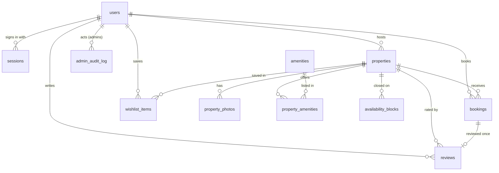

# Database structure

Meridian Stay uses **PostgreSQL** (14 or newer). The schema lives in versioned SQL files in [`apps/api/db/migrations`](../apps/api/db/migrations). They are applied in filename order, and each one runs once (tracked in `schema_migrations`). Never edit a migration that has already run anywhere; add a new numbered file instead.

| Migration | What it adds |
| --- | --- |
| `001_initial_schema.sql` | Users, sessions, listings, photos, amenities, bookings, reviews, wishlists, contact messages |
| `002_control_center.sql` | Suspensions, hidden reviews, featured listings, host date blocks, editable site content, admin audit log |

## Conventions

- **Money** is stored as whole numbers in the smallest unit (cents or paise) in `*_minor` columns, with a `currency` code. The API converts to normal amounts.
- **Stay dates** are `date` (`check_in`, `check_out`). A stay covers the nights from check-in up to, but not including, check-out, so back-to-back bookings share a day.
- **Timestamps** are `timestamptz`. Tables that change have `updated_at`, kept current by a trigger.
- **Emails** are `citext`, so `Priya@…` and `priya@…` are the same account.
- **Fixed lists** are Postgres enums: `user_role`, `property_type`, `listing_status`, `booking_status`, `payment_method`, `payment_status`.

## How the tables relate

`site_settings`, `content_pages` and `contact_messages` stand alone.

## Tables

### People

**`users`**: everyone with an account. `role` is `guest`, `host` or `admin`. `suspended_at` blocks log-in; suspending also deletes the user's sessions. Passwords are stored as scrypt hashes in `password_hash`.

**`sessions`**: one row per signed-in browser. Only a SHA-256 hash of the session token is stored (`token_hash`); the token itself lives in the visitor's HTTP-only cookie. Sessions expire after 30 days.

### Listings

**`properties`**: a stay. Key columns:

| Column | Meaning |
| --- | --- |
| `slug` | The stay's web address, e.g. `/stays/green-valley-organic-farmstay` |
| `host_id` | The owner (`users.id`) |
| `type` | Farmstay, Room, Resort, Cottage or Villa |
| `city`, `region`, `country`, `latitude`, `longitude` | Location, shown as "City, Region" and on maps |
| `price_per_night_minor`, `currency` | Nightly price for up to 2 guests |
| `bedrooms`, `bathrooms`, `max_guests` | Size |
| `status` | `Pending` (waiting for review) → `Approved` (live) or `Rejected` (with `rejection_reason`); `Draft` means paused by the host |
| `featured_rank` | Set by admins; the homepage shows the first six in rank order |
| `rating_avg`, `review_count` | Kept up to date as reviews are added, hidden or restored, so pages don't recount every time |

**`property_photos`**: extra photos in display order (`position`). The cover photo is `properties.cover_image_url`.

**`amenities`** and **`property_amenities`**: the amenity list (with a Font Awesome icon name) and which stays offer which.

**`availability_blocks`**: nights a host has closed (`start_date` to `end_date`, same half-open rule as bookings). Blocks can't overlap each other, and the API won't let a block cover confirmed bookings.

### Bookings

**`bookings`**: one reservation. It keeps a **copy of the price at booking time** (`price_per_night_minor`, `base_amount_minor`, `extra_guest_amount_minor`, `service_fee_minor`, `total_minor`), so later price changes never alter past bookings. A check constraint makes sure the total adds up.

- `code` is the reference shown to guests, e.g. `MS-7K3F9Q`.
- `status` is `Confirmed` or `Cancelled`. "Completed" isn't stored; a confirmed booking whose check-out date has passed is shown as completed.
- `payment_status` is `test` while payments run in test mode; `payment_reference` will hold the payment provider's ID.

**No double bookings:** the constraint `bookings_no_overlap` is a PostgreSQL *exclusion constraint*. The database itself refuses two confirmed bookings for the same stay whose date ranges overlap, even if two guests click "Confirm" at the same moment. The API also locks the listing row while booking so bookings and host blocks can't race each other.

### Reviews and wishlists

**`reviews`**: one per completed booking (`booking_id` is unique). `hidden_at` is set when an admin hides a review; hidden reviews aren't shown or counted. Reviews imported with the demo data have no booking.

**`wishlist_items`**: a guest's saved stays.

### Website content and administration

**`site_settings`**: small JSON documents admins edit, keyed by name: `homepage` (hero text, featured section titles) and `announcement` (the banner at the top of the website).

**`content_pages`**: information pages such as Help, Terms and Privacy. `sections` is JSON: `[{ "heading": "…", "body": ["paragraph", …] }]`. `published = false` hides a page; `is_draft` shows a "draft" notice on it. Default pages are added on first start and never overwritten afterwards.

**`contact_messages`**: messages from the website's contact form, with a status of `new`, `read` or `closed`.

**`admin_audit_log`**: every action taken in the control center: who, what, which record, and details such as a rejection reason.

## Demo data

[`apps/api/src/db/seed.ts`](../apps/api/src/db/seed.ts) fills an **empty** database with fictional demo data. It runs automatically in development, and on a deployment only when `SEED_DEMO_DATA=true`. Booking dates are relative to the day it runs, so there are always past and upcoming stays. It never runs on a database that already has users.
